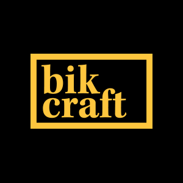

<h4 align="center">
 
 <b>Bicicletas feitas a mão</b>
</h4>

## :rocket: Tecnologias Usadas
Este maravilhoso projeto foi desenvolvido com as seguintes tecnologias:
* HTML5
* CSS3
* Javascript
* Jquery
* responsiveslides
* modernizr
* PHPMailer

## :muscle: Projeto
Bikcraft é um projeto que une durabilidade, design e sustentabilidade.

## :recycle: Como contribuir
* Fork esse repositório;
* Crie uma branch com a sua feature:` git checkout -b myfeature`
* Commit suas mudanças:` git commit -m "feat: My new feature"`
* Push sua branch:` git push origin my-feature`

## :mortar_board: Quem ministrou?
O curso foi ministrado pelo mestre [André Rafael](https://github.com/origamid)

---

Feito com ❤️ por <strong>Oziel Gonçalves :wave: 

